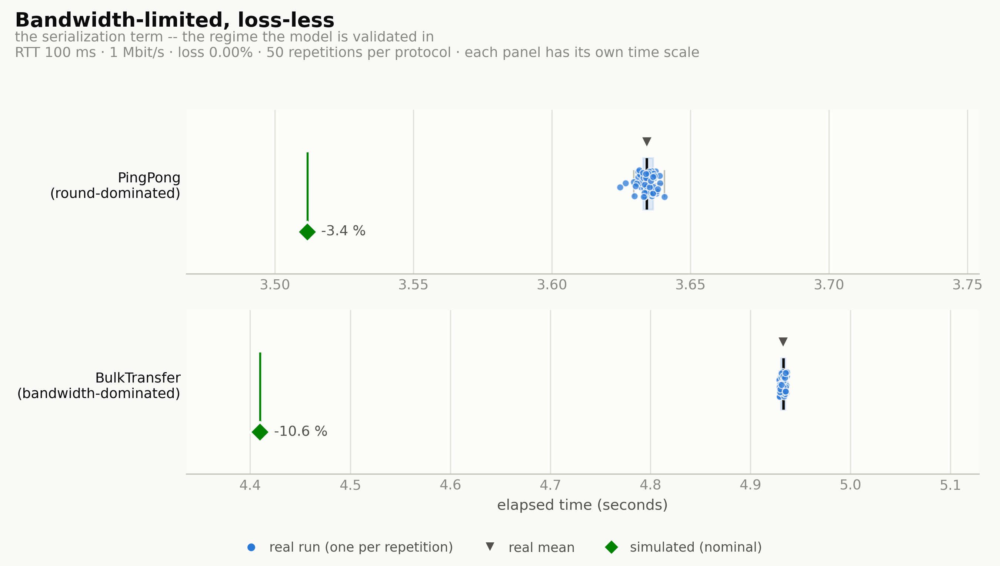
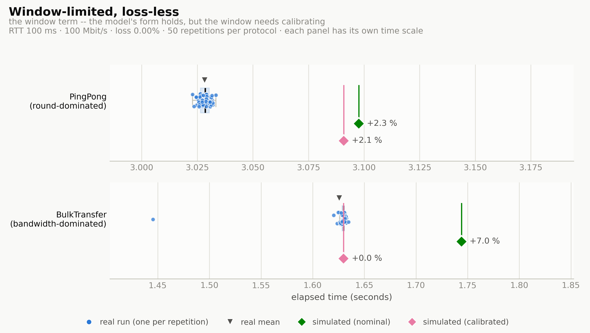
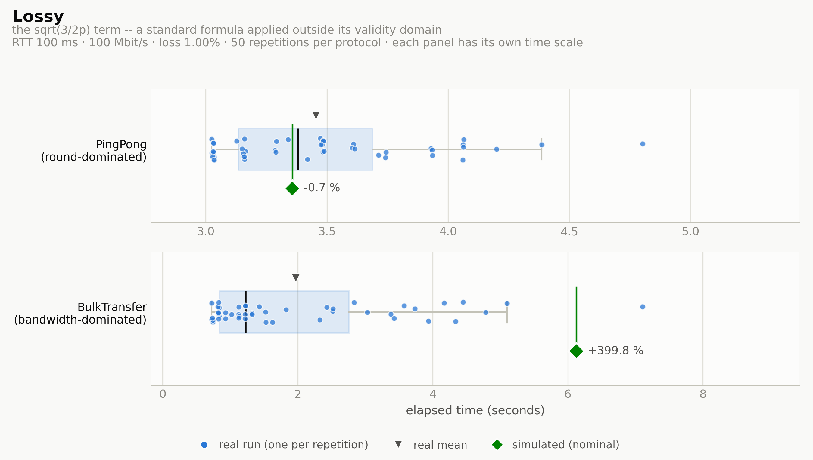

# Simulated vs. real execution

This harness measures how closely the deterministic simulator predicts a real
mutually-authenticated-TLS run, across the three network regimes the crate README reports on. It
produces one tidy CSV, `results/measurements.csv`, with every repetition recorded individually so
the *distribution* is visible — not just a mean. That matters most in the lossy regime, where the
README's finding is not that the model is off by some percentage but that real runs are not
reproducible at all.

## Results

From a 50-repetition run of every scenario/protocol pair. Each panel shows all 50 real runs (dots),
their distribution (box, median line, mean triangle) and the simulator's point prediction (diamond)
labelled with its error against the real median. **Every panel carries its own time scale** — the
two protocols within a scenario sit far enough apart that a shared axis would flatten each
distribution to a sliver.

### Bandwidth-limited, loss-less

<picture>
  <source media="(prefers-color-scheme: dark)" srcset="../../docs/comparison/comparison_dark_bandwidth_limited.png">
  
</picture>

### Window-limited, loss-less

<picture>
  <source media="(prefers-color-scheme: dark)" srcset="../../docs/comparison/comparison_dark_window_limited.png">
  
</picture>

### Lossy

<picture>
  <source media="(prefers-color-scheme: dark)" srcset="../../docs/comparison/comparison_dark_lossy.png">
  
</picture>

### Summary

Positive means the simulator over-predicts (predicted slower than reality). Party 0 only.

| Scenario | Protocol | Prediction | Sim (s) | Real median (s) | Real mean (s) | Real min–max (s) | vs median | vs mean |
|---|---|---|---|---|---|---|---|---|
| bandwidth-limited | ping_pong | nominal | 3.512 | 3.634 | 3.634 | 3.625–3.641 | −3.4 % | −3.4 % |
| bandwidth-limited | bulk_transfer | nominal | 4.410 | 4.933 | 4.933 | 4.929–4.937 | −10.6 % | −10.6 % |
| window-limited | ping_pong | nominal | 3.098 | 3.029 | 3.028 | 3.023–3.033 | +2.3 % | +2.3 % |
| window-limited | ping_pong | **calibrated** | 3.091 | 3.029 | 3.028 | 3.023–3.033 | **+2.1 %** | +2.1 % |
| window-limited | bulk_transfer | nominal | 1.744 | 1.630 | 1.626 | 1.445–1.635 | +7.0 % | +7.3 % |
| window-limited | bulk_transfer | calibrated | 1.630 | 1.630 | 1.626 | 1.445–1.635 | +0.0 %* | +0.3 %* |
| lossy | ping_pong | nominal | 3.358 | 3.380 | 3.454 | 3.025–4.803 | −0.7 % | −2.8 % |
| lossy | bulk_transfer | nominal | 6.125 | 1.225 | 1.969 | 0.727–7.108 | +399.8 % | +211.1 % |

\* **Circular, and not evidence.** The calibrated window was recovered from `bulk_transfer`'s own
median, so it agrees with it by construction. The out-of-sample check is the calibrated `ping_pong`
row, which was not used to fit the window.

### What this run found

**The loss formula's error is confined to bandwidth-dominated protocols.** This is the sharpest
result here, and it is more specific than "treat lossy timings as order-of-magnitude". `PingPong`
under 1 % loss is predicted to within 0.7 %, while `BulkTransfer` on the *same shaped link* is over-
predicted by 400 %. The `√(3/2p)` term enters only through throughput, so a protocol whose running
time is dominated by round trips barely touches it, and one dominated by serialization is priced
almost entirely by it.

**Lossy runs are not reproducible**, which is the reason this harness repeats rather than reporting
a single number: `bulk_transfer` spanned 0.727 s to 7.108 s across 50 identical trials (CV 75 %).
Note the mean sits well above the median — the distribution is strongly right-skewed, so the
mean-based error (+211 %) and the median-based one (+400 %) tell different stories. The formula
claims to predict an ensemble *mean*, which is why both are tabulated.

**The bandwidth-limited regime under-predicts**, by 3.4 % (`ping_pong`) and 10.6 % (`bulk_transfer`).
The simulator prices an idealized steady-state throughput, and the shaped link's real goodput falls a
little short of it — from protocol framing and the `tc` rate limiter's own accounting the model does
not reproduce — a shortfall that grows with bytes moved, so the bulk transfer's gap exceeds the
latency-bound ping-pong's. It is not TCP slow start: at 1 Mbit/s the bandwidth-delay product is
12.5 KB, below Linux's initial congestion window, so the pipe fills within the first round trip. This
is left uncorrected deliberately — it is overhead a short MPC protocol genuinely pays.

**Loss-less runs are extremely reproducible** — CV of 0.0–0.1 % over 50 repetitions — so the
distributions in the first two figures are honestly that tight, not a rendering artifact.

## Quick start

```bash
./benches/comparison/run_all.sh              # ~26 min, prompts before touching the network
python3 benches/comparison/plot.py           # figures + summary.md into results/
./benches/comparison/shape.sh teardown       # only if something is interrupted hard
```

Useful variations:

```bash
./run_all.sh --reps 5                        # a quick shakedown before committing to a full run
./run_all.sh --scenarios lossy               # one regime
./run_all.sh --protocols ping_pong --yes     # one protocol, no confirmation prompt
./run_all.sh --out /tmp/run2.csv             # somewhere other than results/
```

## The design

### Two protocols, one per regime

Both live in `protocols.rs`, are written once against `Environment`, and run unchanged on both
backends — that portability is the property under test.

| Protocol | Shape | Running time | Probes |
|---|---|---|---|
| `PingPong` | 30 sequential round trips of 1 KB | `rounds × RTT` | the latency term |
| `BulkTransfer` | one 0.5–1 MB message plus an ack | `bytes × 8 / throughput` | the throughput term |

They are synthetic on purpose. A real MPC protocol folds local compute into the wall clock, and the
simulator models no compute at all, so a gap between backends could not be attributed to the
network model. These two do nothing but move bytes.

### Three scenarios, one per binding term

Defined once in `scenarios.rs`, which is the single source of truth for *both* the simulator's
`ChannelConfig` and the `tc` shaping — so the two links cannot silently drift apart. The parameters
are chosen so a different term of the model binds in each, and `scenarios.rs` recomputes which one
actually binds rather than trusting the label:

```
$ ./benches/comparison/run_all.sh --help      # or, directly:
$ <comparison-bin> scenarios

bandwidth_limited  rtt=100ms bandwidth=1000000 loss=0 window=65536B mss=1460B
                     bdp=12500B -> binds on bandwidth at 1.00 Mbit/s
window_limited     rtt=100ms bandwidth=100000000 loss=0 window=65536B mss=1460B
                     bdp=1250000B -> binds on window at 5.24 Mbit/s
lossy              rtt=100ms bandwidth=100000000 loss=0.01 window=65536B mss=1460B
                     bdp=1250000B -> binds on loss at 1.43 Mbit/s
```

### What is timed

Each party's own view of the protocol span, on both backends, excluding connection setup:

- **Simulated** — virtual time between the party's `Start` and `Stop` trace events.
- **Real** — wall clock around `Protocol::execute`, started only after a barrier round trip has
  confirmed the TLS connection is established and warm. The TCP connect, the TLS handshake and the
  barrier are all excluded; the simulator models none of them, and under a lossy shape handshake
  retransmits vary far more than the protocol does.

Party 0 is the initiator and the headline figure. Party 1's row is recorded too and sits about half
a round trip lower — in both backends, for the same structural reason: it opens its span on a
receive rather than a send.

**Not corrected for:** every real repetition runs over a fresh connection and so pays TCP slow
start, which the simulator's steady-state throughput does not model. That is left in rather than
warmed away, because it is a cost a short MPC protocol genuinely pays.

## Network shaping

`shape.sh` applies each scenario to loopback. Four changes, each with a reason:

- **A `prio` qdisc with a netem band, selected by port filter.** Delay, rate and loss reach *only*
  ports 6000–6001. Shaping loopback wholesale would put 50 ms of latency and a 1 Mbit/s cap on
  every local service on the machine. The priomap is overridden to all-ones so no unclassified
  traffic can reach the shaped band via its TOS bits.
- **MTU lowered to 1500.** Loopback defaults to 65536, making the real MSS ~65483 rather than the
  1460 the simulator prices with. Mild distortion in the loss-less scenarios (per-segment header
  overhead charged against a segment 45× too large); severe in the lossy one, whose model term is
  *linearly* proportional to MSS.
- **GSO/TSO/GRO disabled.** Otherwise netem receives aggregated super-packets of up to 64 KB even
  at a 1500-byte MTU, so one drop discards ~44 segments. `shape.sh` verifies these actually went
  off and warns loudly if the kernel refused.
- **`tcp_rmem`/`tcp_wmem` pinned to 131072 — window-limited scenario only.** That scenario needs a
  window that does not autotune out of the regime. The other two leave autotuning alone; there, a
  large real window does not change which term binds.

The delay applied is **half** the RTT: a loopback packet crosses the egress qdisc once outbound and
once on the reply.

Every original value is saved to `.shape-state` and restored on exit, including on Ctrl-C. If a run
is killed hard enough to skip the trap, `./shape.sh teardown` restores by hand and
`./shape.sh status` shows what is currently applied.

## Calibration

The window-limited scenario gets a third set of rows. After the real runs, `calibrate` recovers the
window the kernel *actually* delivered — median real bulk span, minus one RTT of propagation, into
throughput, into `T × RTT / 8` — and re-simulates that scenario under it, tagged `calibrated`. This
is the procedure the `WindowSize` documentation prescribes, and it is what separates "the model's
form is wrong" from "the model's form is right but its default window is not the one Linux gave
you". The CSV carries both predictions so a plot can show the nominal miss and the calibrated fit
side by side.

## Output

`results/measurements.csv`, long form — one row per party per repetition, scenario parameters
repeated on each row so a plotting script needs no join:

```
scenario,protocol,source,variant,party,repetition,elapsed_secs,
rtt_ms,bandwidth_bps,loss_fraction,window_bytes,mss_bytes,payload_bytes,rounds
```

| Column | Values |
|---|---|
| `source` | `real` or `sim` |
| `variant` | `shaped` (real); `nominal` or `calibrated` (sim) |
| `party` | `0` (initiator, the headline figure) or `1` |
| `repetition` | `1..N` for real runs; `0` for the deterministic simulated ones |
| `window_bytes` | for `calibrated` rows, the recovered window rather than the configured one |

Reruns append, so delete the file for a clean sheet.

`results/` and `.shape-state` are gitignored — which is why the figures shown above are committed
under `docs/comparison/` instead.

## Plotting

```bash
python3 benches/comparison/plot.py                  # results/fig_*.png + results/summary.md
python3 benches/comparison/plot.py --dark           # dark surface
python3 benches/comparison/plot.py --format pdf     # or svg, for vector output
```

Needs `matplotlib`, `pandas` and `numpy`. It reads `results/measurements.csv`, keeps party 0 (party
1 opens its span on a receive rather than a send, so it sits half a round trip lower in *both*
backends — a robustness check, not a second series), and writes one figure per scenario plus the
summary table.

To regenerate the high-resolution figures committed under `docs/comparison/` and embedded above:

```bash
python3 benches/comparison/plot.py --dpi 300 --outdir docs/comparison \
    --stem comparison_ --no-summary
python3 benches/comparison/plot.py --dpi 300 --outdir docs/comparison \
    --stem comparison_dark_ --dark --no-summary
```

Series colors are slots 1–3 of the reference categorical palette, checked with a palette validator
over all pairs in both light and dark modes rather than chosen by eye — an earlier blue/orange/violet
set passed in light mode but collapsed in dark, where violet against blue measured OKLab ΔE 1.9
under protanopia.

## Files

| File | Role |
|---|---|
| `main.rs` | measurement binary: `scenarios`, `header`, `params`, `sim`, `real`, `calibrate` |
| `protocols.rs` | `PingPong`, `BulkTransfer`, and the pre-timing barrier |
| `scenarios.rs` | the scenario table; drives both the simulator config and the `tc` shaping |
| `run_all.sh` | the driver: shape, repeat, collect, simulate, calibrate, restore |
| `shape.sh` | `setup <scenario>` / `teardown` / `status` |
| `common.sh` | shared paths, ports, and the binary locator |
| `plot.py` | figures + `summary.md` from `measurements.csv` |
| `config_p0.json`, `config_p1.json` | TLS configs; `base_port` **must** match `BASE_PORT` in `common.sh` |

The binary is declared as a `[[bench]]` with `harness = false`, so it is built by
`cargo bench --bench comparison --no-run` and then invoked directly — a repetition is two
concurrent processes, and two `cargo` invocations would serialize on the build lock.
